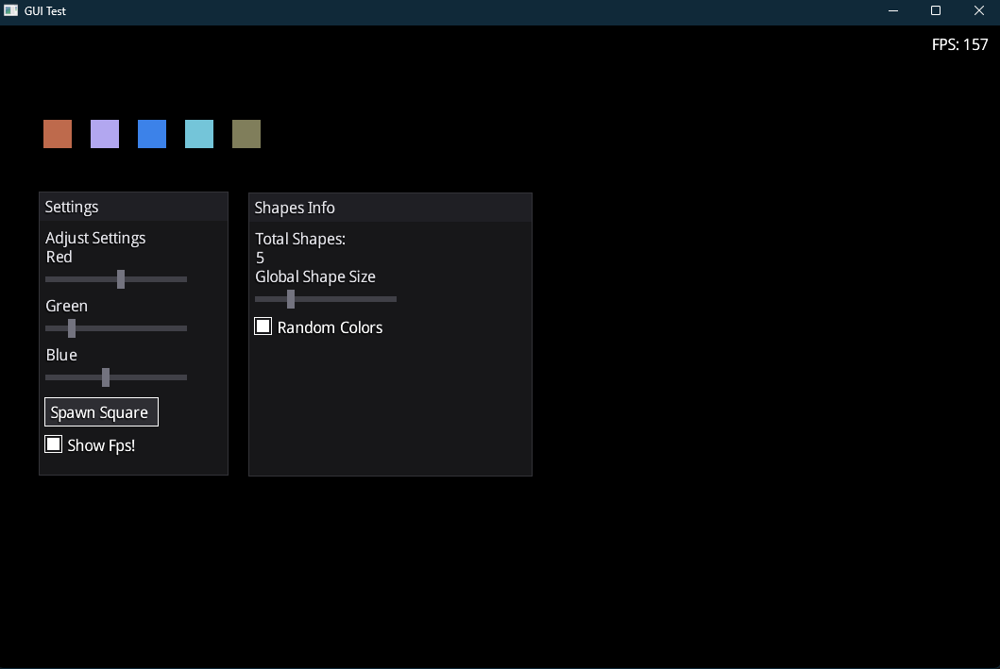

# Custom Immediate-Mode GUI Engine

A lightweight **immediate-mode GUI library** built in C++ using Direct3D 11. Designed for interactive applications, demos, or tools, featuring a fully internal input system, dark-themed styling, and modular components.

---

## Features

- **Windows / Panels**
  - Draggable windows with titlebars
  - Z-order swapping (bring to front on click)
  - Fully dark-themed styling with consistent padding

- **UI Components**
  - **Text**: Display static text with custom colors
  - **Button**: Clickable buttons with callback support
  - **Slider**: Float sliders with live updates and optional callbacks
  - **Checkbox**: Toggleable checkboxes with callbacks
  - **TextInput**: Editable text fields with caret, blinking, and focus handling

- **Internal Input System**
  - Handles **mouse** (hover, click, drag) and **keyboard** (typing, backspace)
  - Focus system ensures components retain input even if window is inactive
  - No need for WndProc forwarding or hooks

- **Custom Styling**
  - Dark theme with consistent colors, padding, and sizes
  - Easily adjustable through `UserInterfaceColors` and `UserInterfaceStyles`

---

## Demo / Example Usage

```cpp
// Example main loop
Window window("GUI Demo", {1400, 800});
Renderer* renderer = window.GetRenderer();
Renderer::Ui& ui = renderer->GetUI();

float sliderR = 0.1f, sliderG = 0.1f, sliderB = 0.1f;
std::string userName;
bool featureEnabled = false;
std::vector<Shape> shapes;

while (window.isRun())
{
    if (!window.broadcast()) break;
    window.onUpdate();
    renderer->Begin();

    ui.BeginWindow("Settings", 100, 100, 300, 400);
    ui.AddText("Adjust Colors", Color(1,1,1,1));
    ui.AddSlider("Red", &sliderR);
    ui.AddSlider("Green", &sliderG);
    ui.AddSlider("Blue", &sliderB);

    ui.AddButton("Add Shape", [&]() {
        shapes.push_back({100, 100, sliderR, sliderG, sliderB, 50});
    });

    ui.AddTextInput("Name", &userName);
    ui.AddCheckbox("Enable Feature", &featureEnabled);
    ui.EndWindow();

    // Draw shapes
    for (auto& s : shapes)
        renderer->AddRectangleFilled({s.x, s.y}, {s.size, s.size}, {s.r, s.g, s.b, 1.f});

    renderer->End();
    window.Present();
}
